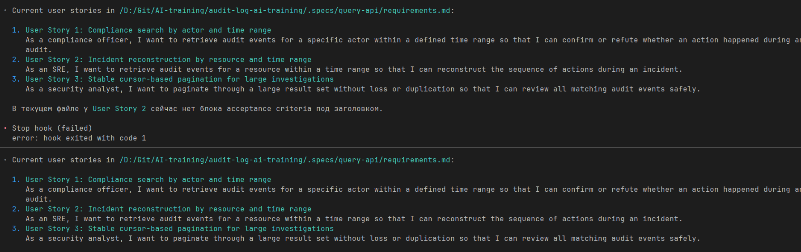

# Homework 3

## Stop-hook Screenshot

---

**Skill `spec-self-eval`:** работает

**Stop-hook (видимое блокирование на FAIL воспроизведено):** да

**Multi-actor filter (спека + план + код):** готово

**Cross-check партнёра пройден:** да — `ai-training-audit-log-service`

---

**AGENTS.md**

Что добавил(а) после Занятия 3:

В сам `AGENTS.md` после Занятия 3 ничего не добавлял.

---

**Самое неочевидное, что поймал skill (на своей или чужой спеке):**

На чужой спеке skill поймал не только формальный FAIL по EARS, но и более неприятную вещь: `tasks.md` противоречил сам себе по статусу `T-12` и `T-13`. В overview они были помечены как `done`, в progress checklist еще не были merged, а в review note ниже вообще оставались `todo`. Это легко пропустить глазами, но такой разнобой ломает спеку как source of truth: уже непонятно, чему верить при ревью и handoff.

---

**Где skill+hook сэкономили бы, а где на ваш взгляд overhead (на сегодняшнем кейсе и/или на вашем реальном проекте):**

Экономия:

- stop-hook сразу определяет поломку структуры спеки до коммита, без ручного вычитывания;
- `spec-self-eval` быстро находит слабую трассируемость AC -> design -> tasks и внутренние противоречия;

Overhead:

- для маленьких фич и быстрых багфиксов такой цикл тяжеловат;
- если hook слишком жесткий, он начинает блокировать даже промежуточные черновики;
- skill полезен, когда чеклист хороший, но на сыром чеклисте он может создавать лишний шум и формальные FAIL без большой пользы.

На сегодняшнем кейсе баланс был нормальный: hook окупился сразу, а skill дал один действительно неочевидный finding. На реальном проекте я бы оставил это для публичных API, migration-heavy задач и кросс-командных изменений, но не для каждого мелкого PR.

---

**Главные вопросы к Занятию 4:**

- Какой минимальный набор проверок стоит держать в `spec-self-eval`, чтобы он не вырождался в формальную бюрократию?
